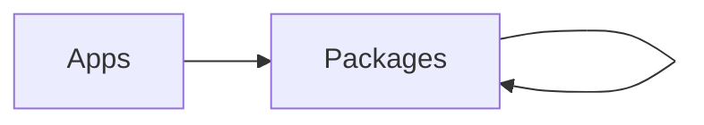
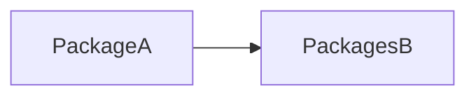
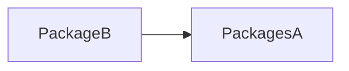
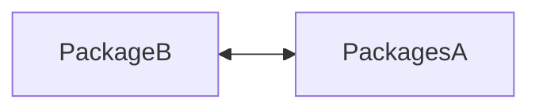

# Technanimals

## Packages

- **[eslint](./packages/config/eslint/README.md):** Linting configuration
- **[jest](./packages/config/jest/README.md):** [Jest](https://jestjs.io/) settings for [Node](https://nodejs.org/en/) and [expo](https://docs.expo.dev)
- **[prettier](./packages/config/prettier/README.md):** Code Formatter
- **[typescript](./packages/config/typescript/README.md):** [Typescript](https://www.typescriptlang.org) configurations for different sets of projects

- **[email](./packages/email/README.md):** Email client provider for different sets of clients
- **[paystack](./packages/paystack/core//README.md):** Backend API communication for the [Paystack API](https://paystack.com/docs/)
- **[react native paystack](./packages/paystack/react-native/README.md):** [React](https://reactjs.org/) and [React Native](https://reactnative.dev/) Paystack library
- **[react](./packages/react/README.md):** React Native library that uses [Styled Systems](https://styled-system.com/) to expose top level styles. Also exposes some commonly used Hooks

## Project Dependency Structure

The general dependency structure in the project can be depicted by the digram below. This means no apps can depend on the code for any other app. While it is okay for a package to depend on another package, but not another app.

The statement above is mostly true, with a bit of a caveat, specifically on the scenario where packages depend on other packages. Cyclic dependencies are not are allowed, this means the relationship between dependencies is unilateral.
**This is allowed**

**This is allowed**

**This is not allowed**

